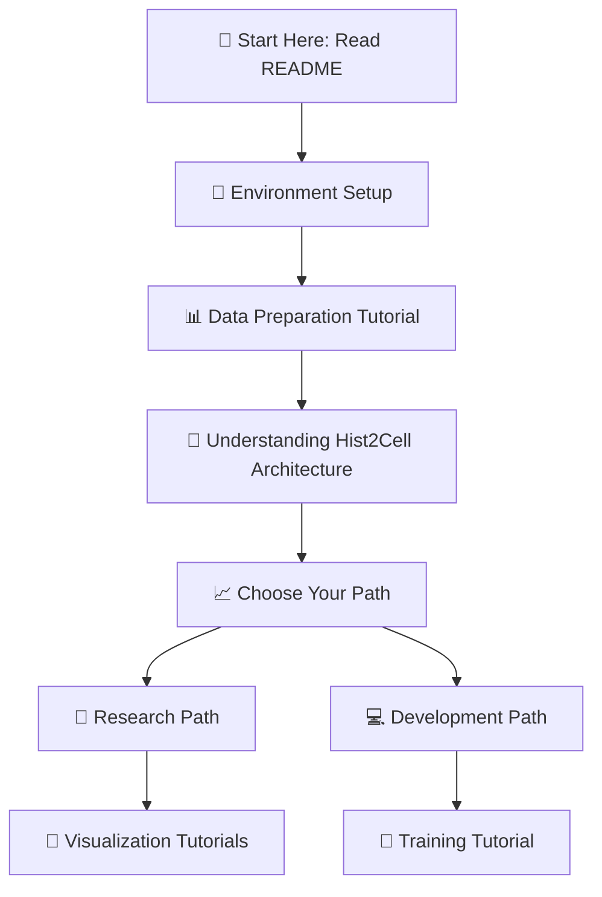

# Hist2Cell: Fine-grained Cell Type Prediction from Histology Images 🧬🔬

<div align="center">

[](https://www.biorxiv.org/content/10.1101/2024.02.17.580852v1.full.pdf)
[](https://www.python.org/)
[](https://pytorch.org/)
[](LICENSE)

**Hist2Cell** is a Vision Graph-Transformer framework that predicts fine-grained cell type abundances directly from histology images, enabling cost-efficient, high-resolution cellular mapping of tissues.


*Predicting cellular compositions from histology images using deep learning*

</div>

---

## 📖 What is Hist2Cell?

**Hist2Cell** is a computational framework for spatial biology analysis. Instead of requiring expensive spatial transcriptomics sequencing, our framework can predict cellular compositions directly from standard histology images.

### 🎯 Key Innovation

- **💰 Cost-Effective**: Eliminates need for expensive spatial sequencing
- **🔬 High Resolution**: Achieves finer spatial detail than traditional methods
- **⚡ Fast Analysis**: Real-time prediction from histology images
- **🌍 Broad Applicability**: Works across different tissue types and diseases

### 🧠 How It Works

Hist2Cell combines three established AI approaches:

1. **🖼️ Computer Vision** (ResNet18): Analyzes tissue morphology from histology images
2. **🕸️ Graph Neural Networks** (GAT): Models spatial relationships between tissue regions
3. **🔄 Vision Transformers**: Captures global tissue context and patterns

---

## 🚀 Quick Start Guide

### Prerequisites

- **Operating System**: Ubuntu 22.04.4 LTS (recommended) or similar Linux distribution
- **Hardware**: GPU with 8GB+ VRAM (16GB+ recommended)
- **Python**: 3.11
- **CUDA**: Compatible GPU with CUDA support

### 🔧 Installation

#### Step 1: Create Conda Environment
```bash
# Create a new conda environment
conda create -n Hist2Cell python=3.11
conda activate Hist2Cell
```

#### Step 2: Clone Repository
```bash
git clone https://github.com/Weiqin-Zhao/Hist2Cell.git
cd Hist2Cell
```

#### Step 3: Install Dependencies
```bash
# Install basic requirements
pip install -r requirements.txt

# Install PyTorch with CUDA support
pip install torch==2.0.1 torchvision==0.15.2 torchaudio==2.0.2 --index-url https://download.pytorch.org/whl/cu118

# Install PyTorch Geometric
pip install torch_geometric
pip install pyg_lib torch_scatter torch_sparse torch_cluster torch_spline_conv -f https://data.pyg.org/whl/torch-2.0.0+cu118.html
```

#### Step 4: Verify Installation
```bash
python -c "import torch; print('CUDA available:', torch.cuda.is_available())"
```

---

## 📚 Comprehensive Tutorial System

We provide a complete learning ecosystem with step-by-step tutorials designed for different skill levels and use cases.

### 🎓 Learning Path for Beginners



### 📋 Tutorial Overview

| Tutorial | Purpose | Skill Level | Time Required | Key Outcomes |
|----------|---------|-------------|---------------|--------------|
| **🔧 Data Preparation** | Learn to process your own spatial transcriptomics data | Beginner | 1-2 hours | Understand data pipeline, prepare custom datasets |
| **🚀 Model Training** | Train Hist2Cell on your own data | Intermediate | 2-4 hours | Custom model training, hyperparameter tuning |
| **🎨 Cell Abundance Visualization** | Create publication-quality spatial plots | Beginner | 30-60 min | Generate visualization of cell distributions |
| **🕸️ Cell Colocalization Analysis** | Analyze spatial relationships between cell types | Advanced | 1-2 hours | Spatial statistics, colocalization patterns |
| **🔍 Super-Resolution Prediction** | Generate enhanced resolution cell maps | Advanced | 1-2 hours | 2× resolution enhancement |

---

## 🗂️ Project Structure

```
Hist2Cell/
├── 📁 tutorial_data_preparation/          # Data processing tutorials
│   └── data_preparation_tutorial.ipynb    # Complete data pipeline guide
├── 📁 tutorial_training/                  # Model training resources
│   └── training_tutorial.ipynb            # Comprehensive training guide
├── 📁 tutorial_analysis_evaluation/       # Analysis and evaluation tutorials
│   ├── cell_abundance_visulization_tutorial.ipynb      # Spatial visualization
│   ├── cell_colocalization_tutorial.ipynb              # Spatial relationships
│   └── super_resovled_cell_abundance_tutorial.ipynb    # Super-resolution analysis
├── 📁 model_weights/                      # Pre-trained model checkpoints
├── 📁 example_data/                       # Example datasets and demonstrations
│   ├── humanlung_cell2location/          # Standard resolution data
│   ├── humanlung_cell2location_2x/       # Super-resolution data
│   └── example_raw_data/                 # Raw data examples
├── 📁 model/                             # Core model architecture
├── 📄 requirements.txt                   # Python dependencies
└── 📖 README.md                          # This comprehensive guide
```

---

## 📊 Datasets and Resources

### 🗄️ Supported Datasets

| Dataset | Tissue Type | Use Case | Availability | Tutorial Coverage |
|---------|-------------|----------|--------------|-------------------|
| **Human Lung** | Healthy lung tissue | Primary examples, tutorials | ✅ Provided | All tutorials |
| **HER2ST** | Breast cancer | Disease applications | 🔗 [External](https://github.com/almaan/her2st) | Advanced usage |
| **STNet** | Various tissues | Method validation | 🔗 [External](https://data.mendeley.com/datasets/29ntw7sh4r/5) | Custom training |
| **TCGA** | Cancer samples | Clinical applications | 🔗 [External](https://portal.gdc.cancer.gov/) | Research projects |
| **HEST-1k** | Multiple organs | Large-scale analysis | 🔗 [External](https://huggingface.co/datasets/MahmoodLab/hest) | Scalability studies |

### 📥 Data Download and Setup

We provide processed example data for tutorials and demonstrations. The original datasets are from the published sources listed above, but we've prepared processed versions for direct use with Hist2Cell.

```bash
# Download processed data from our OneDrive link
# Visit: example_data/README.md for the download link

# After downloading, unzip the data using:
tar -xzvf [downloaded_file.tar.gz]

# Verify example data structure
ls example_data/
# Should show: humanlung_cell2location/, humanlung_cell2location_2x/, example_raw_data/
```

We provide:
- Processed example data of the healthy lung dataset in `./example_data/humanlung_cell2location`
- Super-resolved cell abundance data in `./example_data/humanlung_cell2location_2x`
- Example raw data in `./example_data/example_raw_data`

For users who want to process their own datasets, we provide detailed tutorials in `./tutorial_data_preparation/data_preparation_tutorial.ipynb`.

---

## ⚡ Quick Demo

Want to see Hist2Cell in action immediately? Run this quick demonstration:

```bash
# Navigate to visualization tutorial
cd tutorial_analysis_evaluation/

# Launch Jupyter notebook
jupyter notebook cell_abundance_visulization_tutorial.ipynb

# Follow the step-by-step guide to generate your first spatial cell map!
```

This will generate publication-quality visualizations in under an hour.

---

## 📄 Citation

If you use Hist2Cell in your research, please cite our work:

```bibtex
@article{zhao2024hist2cell,
  title={Hist2Cell: Deciphering Fine-grained Cellular Architectures from Histology Images},
  author={Zhao, Weiqin and Liang, Zhuo and Huang, Xianjie and Huang, Yuanhua and Yu, Lequan},
  journal={bioRxiv},
  pages={2024--02},
  year={2024},
  publisher={Cold Spring Harbor Laboratory}
}
```

---

## 📜 License

This project is licensed under the MIT License - see the [LICENSE](LICENSE) file for details.

---

## 🙏 Acknowledgments

- **🏫 Institutions**: University collaborations and support
- **💰 Funding**: Grant agencies and foundations
- **👥 Community**: Contributors and early adopters
- **🔬 Datasets**: Original data providers and consortiums

---

<div align="center">

### 🚀 Start Your Spatial Biology Journey Today!

**Ready to enhance your tissue analysis?**

[📖 Read the Paper](https://www.biorxiv.org/content/10.1101/2024.02.17.580852v1.full.pdf) • [📚 Tutorials](#-comprehensive-tutorial-system)

---

*Supporting spatial biology research through computational methods*

</div> 