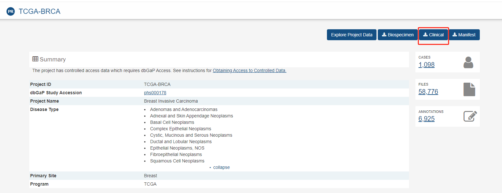
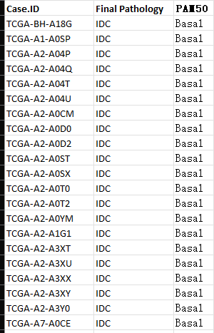
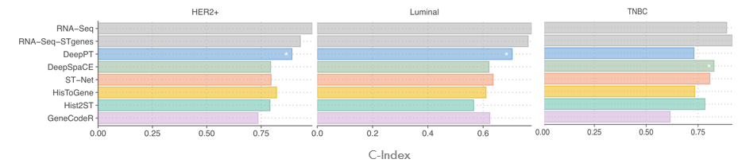

## Subtype prediction

- `brca_clinical_from_tcga.tsv` is from [TCGA GDC](https://portal.gdc.cancer.gov/projects/TCGA-BRCA)

- `mmc2.xlsx` is from a Cell Paper - [Comprehensive Molecular Portraits of Invasive Lobular Breast Cancer](https://www.cell.com/cell/fulltext/S0092-8674(15)01195-2) 
    - in `Supplemental Information Table S1`;
    - it is better to use labels in this file;
    - for subtyping: 
        - `infiltrating ductalcarcinoma` is `IDC`;
        - `infiltrating lobular carcinoma` is `ILC`;
    - for survival:
        - `HER2+` is `HER2`;
        - `Luminal` is `LumA` and `LumB`;
        
        

based on `mmc2.xlsx`, I generate a `filtered_subtyping_label.csv` in `extract_subtyping_label.ipynb`:
- IDC 359 cases;
- ILC 106 cases;

I run a simple logistic regression with 250 highly expressed genes in the ground truth bulk sequence, code in `simple_subtyping_logistic.ipynb`.

The results seems to be comparable with `STNet`.

For our downstream task, just need to **replace the 250 highly expressed genes with our selected genes** in `simple_subtyping_logistic.ipynb`.

## Survival prediction
### Some reference results from Yuanhua's workshop:

### Some reference material about Survival Prediction
[Simple slides](https://docs.google.com/presentation/d/1KomhHjqL585rJ3rTXY7ouN4WY2-F0Q7C2wmm38Ti1Js/edit?usp=sharing) made by zwq, in the first 4 pages.

More details in this paper's supplementary material:
- `/data1/r20user3/shared_project/Hist2Cell/data/brca_clinical_from_cell_paper/MCAT_supplemental.pdf`

### Survival data preprocessing on TCGA BRCA
For each patient, we want 3 labels:
- Y - discrete label of survival(last report) length (I use 4 intervals)
- c - censored: 
    - 0 - already dead at last report; 
    - 1 - still alive at last report;
- event_time: 
    - length of survival(last report) in months

I preprocess `brca_clinical_from_tcga.tsv` for these 3 labels, code in `extract_survival_label.ipynb`.

I spilt the cases with subtypes from `mmc2.xlsx`.

The preprocessed label files are in:
- `/data1/r20user3/shared_project/Hist2Cell/data/brca_clinical_from_cell_paper/brca_survival_label_Luminal.csv`
- `/data1/r20user3/shared_project/Hist2Cell/data/brca_clinical_from_cell_paper/brca_survival_label_HER2.csv`
- `/data1/r20user3/shared_project/Hist2Cell/data/brca_clinical_from_cell_paper/brca_survival_label_Basal.csv`

### Simple survival prediction on TCGA BRCA
I done simple survival prediction within `Luminal` cases.

The code is in `/data1/r20user3/shared_project/Hist2Cell/data/brca_clinical_from_cell_paper/simple_survival_prediction.ipynb`.

On `Luminal`, the best test c-index is 0.7018, slightly worse than the results reported by the group from Sydney University on Yuanhua's workshop. But it is a relatively good number according to my experimence.

### Draw KM curve for survival prediction
I write an exmaple code in the end of `simple_survival_prediction.ipynb` to draw KM curve.

Check the code for more details and reference materials.
